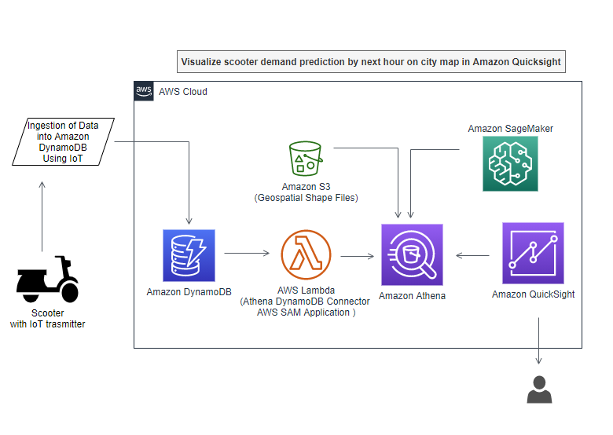

# Use ML predictions over Amazon DynamoDB data with Amazon Athena ML

Today’s modern applications use multiple purpose-built database engines, including relational, key-value, document, and in-memory databases. This purpose-built approach improves the way applications use data by providing better performance and reducing cost. However, the approach raises some challenges for data teams that need to provide a holistic view on top of these database engines, and especially when they need to merge the data with datasets in the organization’s data lake.

In this post, we show how you can use Amazon Athena to build complex aggregations over data from Amazon DynamoDB and enrich the data by ML inference using Amazon SageMaker. You use some of the latest features announced by Athena such as the Athena Query Federation, integration with Amazon SageMaker for machine learning (ML) predictions, and querying geospatial data in Athena.

Assume you are operating a fleet of scooters, and need to forecast, that enough scooters are made available in each part of the city. Specifically, you need to predict the number of scooters needed in each urban neighborhood for the upcoming hour. You have a pre-trained ML model that forecasts the demand for the next hour based on data from the past five hours. You will use Athena and Amazon QuickSight to predict and visualize the demand respectively.

## Solution overview
The following diagram shows the overall architecture of our solution.

We use the following resources:

•	A public dataset of dockless vehicle rentals, provided by the Office of Civic Innovation and Technology of the Louisville (KY) Metro Government. This data is pre-populated in the DynamoDB part of the use case. However, in real life, this data would be sent to DynamoDB through various mechanisms such as internet of things (IoT) devices or Amazon Kinesis consumers, which insert data into DynamoDB via AWS Lambda.
•	Boundaries of historical and cultural neighborhoods within the city of Louisville. The public dataset is provided by the Louisville and Jefferson County, KY Information Consortium (LOJIC). You can download the GIS shapefiles directly. We converted original shapefiles into a text file that you can query with Athena. You can find the Python code for transforming shapefiles in the Jupyter notebook Geo-Spatial processing of GIS shapefiles with Amazon Athena.
•	A pre-trained ML model for hourly forecasts. You can find the Python code for training the ML model in the notebook Demand Prediction for scooters using Amazon SageMaker and Amazon Athena.
•	A SQL query in Athena that brings everything together for live predictions from the data stored in DynamoDB.
•	Optionally, you can use QuickSight to visualize geospatial data over a map of Louisville, Kentucky (see the following example).

&nbsp;&nbsp;&nbsp;&nbsp;



&nbsp;&nbsp;&nbsp;&nbsp;

Populate DynamoDB with data and create a SageMaker endpoint to query in Athena
For this post, we populate the DynamoDB table with scooter data. For demand prediction, we create a new Amazon SageMaker endpoint using a pre-trained XGBoost model using elastic container registry path from region in us-east-1.

1. Download [CloudFormation template](cfn/athena-dynamodb-ml.yaml), Choose Create Stack with new resources in the us-east-1 region, and upload the downloaded file:

2. On the CloudFormation console, accept default values for the parameters.
3. Select I acknowledge that AWS CloudFormation might create IAM resources with custom names.
4. Choose Create stack.
The stack creates the 5 resources:

•	A DynamoDB table
•	A Lambda function to load the table with relevant data
•	A SageMaker endpoint for inference requests, with the pre-trained XGBoost model from an Amazon Simple Storage Service (Amazon S3) location
•	An Athena workgroup named V2EngineWorkGroup
•	Named Athena queries to look up the shapefiles and predict the demand for scooters

The CloudFormation template also deploys a pre-built DynamoDB-to-Athena connector, using the AWS Serverless Application Model (AWS SAM).

It can take up to 15–20 minutes for the CloudFormation stack to create these resources.

You can verify the sample data provided by AWS CloudFormation was loaded into DynamoDB by navigating to the DynamoDB console and checking for the table named DynamoDBTableDocklessVehicles.


1.	When resource creation is complete, on the Athena console, choose Workgroups.
2.	Select the workgroup V2EngineWorkGroup and choose Switch workgroup.
3.	If you get a prompt to save the query result location, choose an S3 location where you have write permissions.
4.	Choose Save.
5.	In the Athena query editor, select the database athena-ml-db-<your-AWS-Account-Number>.

Now let’s load the geolocation files into the Athena database.

Create an Athena table with geospatial data of neighborhood boundaries
To load the geolocation files into Athena, complete the following steps:

1.	On the Athena console, choose Saved queries.
2.	Search for and select Q1: Neighborhoods.
3.	Return to the Athena SQL window.
This query creates a new table for the geospatial data that represents the urban neighborhoods of the city. The data table has been created from GIS shapefiles. The following CREATE EXTERNAL TABLE statement defines the schema of the table, and the location and format of the underlying data file. You can find the Python code to process shapefiles and produce this table in the notebook Geo-Spatial processing of GIS shapefiles with Amazon Athena.

````  Start SQL -----
-- Q1: Neighborhoods
-- -----------------
-- This Athena statement creates a table entry in the Glue catalog
-- The data format is a TAB-seperated text file without header row
--
CREATE EXTERNAL TABLE "<Here goes your Athena database>"."louisville_ky_neighborhoods"
(
    `objectid` int,
    `nh_code` int,
    `nh_name` string,
    `shapearea` double,
    `shapelen` double,
    `bb_west` double,
    `bb_south` double,
    `bb_east` double,
    `bb_north` double,
    `shape` string,
    `cog_longitude` double,
    `cog_latitude` double)
ROW FORMAT DELIMITED
 FIELDS TERMINATED BY '\t'
 LINES TERMINATED BY '\n'
STORED AS INPUTFORMAT 'org.apache.hadoop.mapred.TextInputFormat'
OUTPUTFORMAT 'org.apache.hadoop.hive.ql.io.HiveIgnoreKeyTextOutputFormat'
LOCATION 's3://<Here goes your S3 bucket>/louisville_ky_neighborhoods/'
TBLPROPERTIES (
    'has_encrypted_data'='false'
)
--------- End SQL -----
````

4.	Choose Run query or press CTRL+Enter.

This action creates a table named louisville_ky_neighborhoods in your database. Make sure the table is created in the database athena-ml-db-<your-AWS-Account-Number>.


Predict demand for scooters by neighborhood from the aggregated DynamoDB data
Now you can use Athena to query transactional data directly from DynamoDB, and aggregate it for analysis and forecast. This feature isn’t easily achieved by directly querying a DynamoDB NoSQL database.

1.	On the Athena console, choose Saved queries
2.	Search for and select Q2: DynamoDBAthenaMLScooterPredict.
3.	Return to the Athena SQL window.

This SQL statement demonstrates the use of the Athena Query Federation SDK to query the DyanamoDB table with the raw trip data, Athena’s geospatial functions to place geographic coordinates into neighborhoods, and how to enrich data by ML inference using SageMaker.

The first part of the SQL statement declares the external function to query ML inferences from the SageMaker endpoint that hosts the pretrained model. We need to define the order and type of the input parameters and the type of the return values.
We use several sub-queries to build the feature table for ML prediction. With the first select statement we query the raw data from DynamoDB for a given 5-hour window. Then we locate the start and end locations of each trip record within their urban neighborhoods. Next, we create two aggregations over time and space for the start and end of the trips and combine them to generate a table with the number of trips per hour that started and ended within each of the neighborhoods. Among a few other parameters, we use the hourly counts for the past 4 hours to predict the demand for vehicles for the next hour. You can find the Python code for training the ML model in the notebook Demand Prediction for scooters using Amazon SageMaker and Amazon Athena.

    ````sql
            -- Q2: DynamoDBAthenaMLScooterPredict
            -- ----------------------------------
            -- Query demand of scooters for the next hour
            --
            -- Define function to represent the SageMaker model and endpoint for the prediction
            USING EXTERNAL FUNCTION predict_demand( location_id BIGINT, hr BIGINT , dow BIGINT,
            n_pickup_1 BIGINT, n_pickup_2 BIGINT, n_pickup_3 BIGINT, n_pickup_4 BIGINT,
            n_dropoff_1 BIGINT, n_dropoff_2 BIGINT, n_dropoff_3 BIGINT, n_dropoff_4 BIGINT
            )
            RETURNS DOUBLE SAGEMAKER '<Here goes your SageMaker endpoint>'
            -- query raw trip data from DynamoDB, we only need the past five hours (i.e. 5 hour time window ending with the time we set as current time)
            WITH trips_raw AS (
                SELECT *
                , from_unixtime(start_epoch) AS t_start
                , from_unixtime(end_epoch) AS t_end
                FROM "lambda:<Here goes your DynamoDB connector>"."<Here goes your database>"."<Here goes your DynamoDB table>" dls
                  WHERE start_epoch BETWEEN to_unixtime(TIMESTAMP '2019-09-07 15:00' - interval '5' hour) AND to_unixtime(TIMESTAMP '2019-09-07 15:00')
                      OR end_epoch BETWEEN to_unixtime(TIMESTAMP '2019-09-07 15:00' - interval '5' hour) AND to_unixtime(TIMESTAMP '2019-09-07 15:00')
            ),
            -- prepare individual trip records
            trips AS (
                SELECT tr.*
                    , nb1.nh_code AS start_nbid
                    , nb2.nh_code AS end_nbid
                    , floor( ( tr.start_epoch - to_unixtime(TIMESTAMP '2019-09-07 15:00' - interval '5' hour) )/3600 ) AS t_hour_start
                    , floor( ( tr.end_epoch - to_unixtime(TIMESTAMP '2019-09-07 15:00' - interval '5' hour) )/3600 ) AS t_hour_end
                FROM trips_raw tr
                JOIN "AwsDataCatalog"."<Here goes your Athena database >"."louisville_ky_neighborhoods" nb1
                    ON ST_Within(ST_POINT(CAST(tr.startlongitude AS DOUBLE), CAST(tr.startlatitude AS DOUBLE)), ST_GeometryFromText(nb1.shape))
                JOIN "AwsDataCatalog"."< Here goes your Athena database >"."louisville_ky_neighborhoods" nb2
                    ON ST_Within(ST_POINT(CAST(tr.endlongitude AS DOUBLE), CAST(tr.endlatitude AS DOUBLE)), ST_GeometryFromText(nb2.shape))
            ),
            -- aggregating trips over start time and start neighborhood
            start_count AS (
                SELECT start_nbid AS nbid, COUNT(start_nbid) AS n_total_start
                    , SUM(CASE WHEN t_hour_start=1 THEN 1 ELSE 0 END) AS n1_start
                    , SUM(CASE WHEN t_hour_start=2 THEN 1 ELSE 0 END) AS n2_start
                    , SUM(CASE WHEN t_hour_start=3 THEN 1 ELSE 0 END) AS n3_start
                    , SUM(CASE WHEN t_hour_start=4 THEN 1 ELSE 0 END) AS n4_start
                FROM trips
                    WHERE start_nbid BETWEEN 1 AND 98
                GROUP BY start_nbid
            ),
            -- aggregating trips over end time and end neighborhood
            end_count AS (
                SELECT end_nbid AS nbid, COUNT(end_nbid) AS n_total_end
                    , SUM(CASE WHEN t_hour_end=1 THEN 1 ELSE 0 END) AS n1_end
                    , SUM(CASE WHEN t_hour_end=2 THEN 1 ELSE 0 END) AS n2_end
                    , SUM(CASE WHEN t_hour_end=3 THEN 1 ELSE 0 END) AS n3_end
                    , SUM(CASE WHEN t_hour_end=4 THEN 1 ELSE 0 END) AS n4_end
                FROM trips
                WHERE end_nbid BETWEEN 1 AND 98
                GROUP BY end_nbid
            ),
            -- call the predictive model to get the demand forecast for the next hour
            predictions AS (
                SELECT sc.nbid
                    , predict_demand(
                    CAST(sc.nbid AS BIGINT),
                    hour(TIMESTAMP '2019-09-07 15:00'),
                    day_of_week(TIMESTAMP '2019-09-07 15:00'),
                    sc.n1_start, sc.n2_start, sc.n3_start, sc.n4_start,
                    ec.n1_end, ec.n2_end, ec.n3_end, ec.n4_end
                    ) AS n_demand
                FROM start_count sc
                JOIN end_count ec
                  ON sc.nbid=ec.nbid
            )
            -- finally join the predicted values with the neighborhoods' meta data
            SELECT nh.nh_code AS nbid, nh.nh_name AS neighborhood, nh.cog_longitude AS longitude, nh.cog_latitude AS latitude
                , ST_POINT(nh.cog_longitude, nh.cog_latitude) AS geo_location
                , COALESCE( round(predictions.n_demand), 0 ) AS demand
            FROM "AwsDataCatalog"."< Here goes your Athena database >"."louisville_ky_neighborhoods" nh
            LEFT JOIN predictions
                ON nh.nh_code=predictions.nbid

''''

4. Choose Run query or press CTRL+Enter to run the query and predict demand for scooters.

The output table includes the neighborhood, longitude and latitude of the centroid of the neighborhood, and the number of vehicles that are predicted for the next hour. This query produces the predictions for a selected point in time. You can make predictions for any other time by changing the expression  TIMESTAMP '2019-09-07 15:00' everywhere in the statement, Change it to NOW()if you have a real-time data feed from your DynamoDB table.


Visualize predicted demand for scooters in QuickSight
You can use the same Athena query (Q2) to visualize the data in QuickSight. You may have to add additional permissions to your QuickSight role to invoke Lambda functions to access the DynamoDB tables and SageMaker endpoints for the predictions. For detailed instructions on how to set up QuickSight to visualize geo-location coordinates, see the GitHub repo.

As you can see in the following QuickSight visualization, we can spot the demand for scooters on the map of Louisville, Kentucky. Circles with bigger radius denote higher demand for scooters in that neighborhood. You can also hover over any of the circles to look at the detailed demand count and the name of the neighborhood.


With live data, you can also set the refresh rate on your QuickSight dashboard to update the demand prediction automatically.

Clean up
When you’re done, clean up the resources you created as part of this solution.

1.	On the Amazon S3 console, empty the bucket you created as part of the CloudFormation stack.
2.	On the AWS CloudFormation console, find stack with name "bdb-1462-athena-dynamodb-ml-stack" and delete the stack.
3.	Navigate to the Amazon CloudWatch console, choose Log groups from the Logs menu and delete the "/aws/sagemaker/Endpoints/Sg-athena-ml-dynamodb-model-endpoint" Log Group.

Conclusion
This post demonstrated how to query data in Athena using the Athena Federated Query for DynamoDB, and enrich data with ML inference using SageMaker. We also showed how you can integrate geo-location-based queries, using geospatial features in Athena. The Athena Query Federation is very extensible and queries data from multiple data sources such as DynamoDB, Amazon Neptune, Amazon ElastiCache for Redis, and Amazon Relational Database Service (Amazon RDS), and gives customers a wide range of possibilities to aggregate data.

