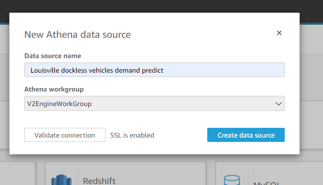

# QuickSight Set Up
&nbsp;&nbsp;&nbsp;
## QuickSight permissions set up
1) Navigate to QuickSight
2) Choose on upper right side on your user name
3) Open the context menu and choose on "Manage QuickSight"
&nbsp;&nbsp;&nbsp;&nbsp;

&nbsp;&nbsp;&nbsp;&nbsp;
4) On the left side of the page choose "Choose Security & Permissions".
5) Then choose “Add or remove” under "QuickSight access to AWS services"
6) Choose checkboxes for Amazon S3, Amazon Athena, and Amazon Sagemaker and choose “Update”.

&nbsp;&nbsp;&nbsp;&nbsp;

&nbsp;&nbsp;&nbsp;&nbsp;

7) Choose correct region on your QuickSight dashboard, choose region same where you have set up your Athena queries.

&nbsp;&nbsp;&nbsp;&nbsp;

&nbsp;&nbsp;&nbsp;&nbsp;

8) Now navigate to Clouformation console, select the stack you created part of the blog post, and go to "Outputs" tab. Then select value of key "QuickSightPolicy" copy the value to clipboard. Now navigate to IAM console , choose "Roles" from the side pane, and then search for role "aws-quicksight-s3-consumers-role-v0", then select that role. Now choose "Attach policies", and search for the policy we just copied in clipboard previously.  Select the policy and choose "Attach policy"
&nbsp;&nbsp;&nbsp;&nbsp;

&nbsp;&nbsp;&nbsp;&nbsp;
## Configure Quicksight for Geo coordinates for the Athena query.

&nbsp;&nbsp;&nbsp;&nbsp;

8) Once on QuickSight dashboard, choose “New Analysis” button, then choose “New dataset” , then choose “Athena” , Enter data source name e.g. “Louisville dockless vehicles demand predict”. Choose Athena workgroup “V2EngineWorkGroup” . You can also choose validate connection. Then choose “Create data source” . On the next pop up screen, choose Catalog as “AwsDataCatalog” and Database as “default”. Choose “Use custom SQL”. Copy entire query Q2 from Amazon Athena into the given textbox. Now choose “Edit/Preivew Data.

&nbsp;&nbsp;&nbsp;&nbsp;

&nbsp;&nbsp;&nbsp;&nbsp;

9) One the pane choose “Apply button”, this action should run the query and produce exact same predictions as on Athena console.

&nbsp;&nbsp;&nbsp;&nbsp;

&nbsp;&nbsp;&nbsp;&nbsp;

&nbsp;&nbsp;&nbsp;&nbsp;

&nbsp;&nbsp;&nbsp;&nbsp;

&nbsp;&nbsp;&nbsp;&nbsp;

&nbsp;&nbsp;&nbsp;&nbsp;

11) On the left side choose “SPICE” as the Query mode. Then choose "Save and visualize"

&nbsp;&nbsp;&nbsp;&nbsp;

&nbsp;&nbsp;&nbsp;&nbsp;
12) On the Visualize screen, select Visual Types as "Points on Map", then drag fields longitude and latitude to Geospatial, demand to Size, and neighbourhood to Color field wells respectively.

&nbsp;&nbsp;&nbsp;&nbsp;

&nbsp;&nbsp;&nbsp;&nbsp;
13)QuickSight should automatically update to display the coordinates and their respective demand.

&nbsp;&nbsp;&nbsp;&nbsp;

&nbsp;&nbsp;&nbsp;&nbsp;

